# Steps
## Create SQS queue
Enter queue name and leave default settings

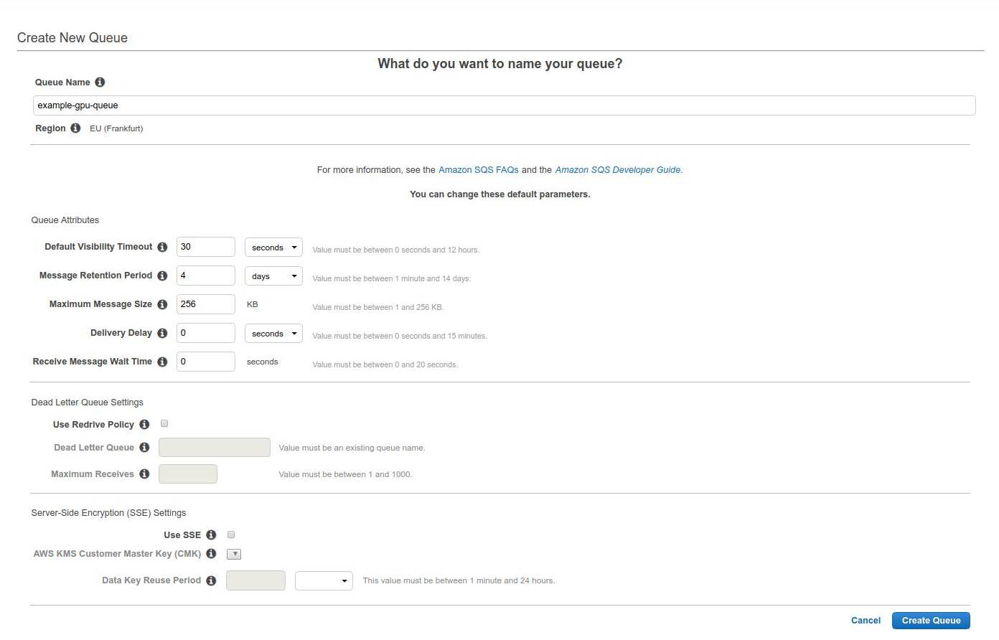

Add permissions to push messages from S3:
1. Edit the created queue
2. Set Principal to Everybody 
3. Select action SendMessage
4. Add condition (Qualifier - ```None```, Condition - ```ArnLike```, Key - ```aws:SourceArn```, value - ```arn:aws:s3:*:*:your-bucket```)

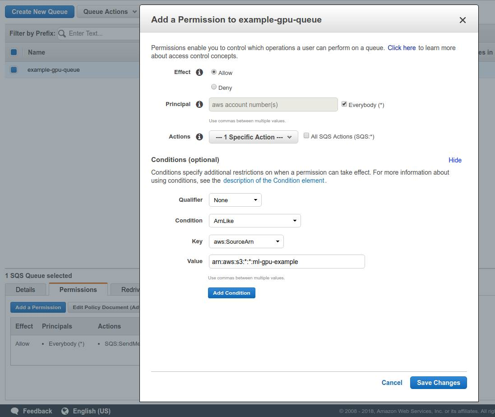

## Create S3 bucket and setup SQS notification
Setup S3 Events to send messages to the created SQS queue on put objects:

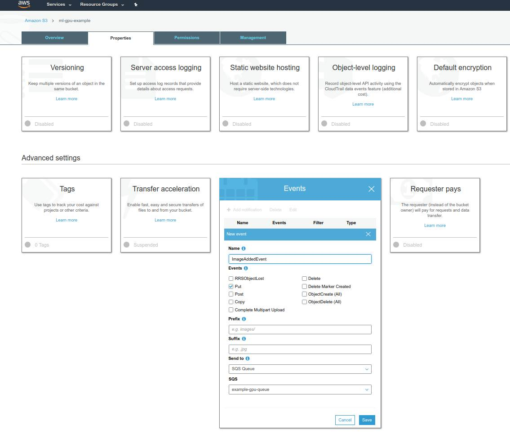

## 1. Create custom nvidia-docker2 AMI
1. From EC2 console select and launch Deep learning base AMI (version 12):

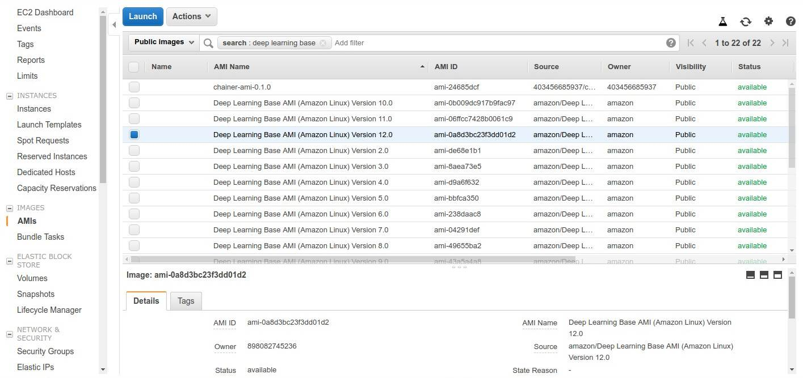

2. Select gpu instance type (p2.xlarge):

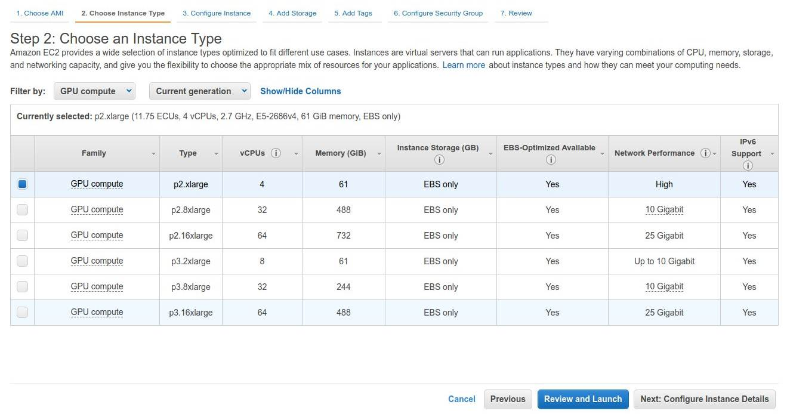

3. Configure additional settings and launch. Select ssh key or create a new one when asked.
4. Connect to the launched as ec2-user instance using SSH.
5. Base deep learning has cuda drivers and nvidia-docker2 installed, bus has no ecs agent, therefore it has to be installed by executing
```sudo yum install -y ecs-init```
6. To verify nvidia docker working run: 
    
    ``` CUDA_VERSION=$(cat /usr/local/cuda/version.txt | awk '{ print $3 }' | cut -f1-2 -d".")```  
    
    and 
    
    ```sudo docker run --privileged --runtime=nvidia --rm nvidia/cuda:$CUDA_VERSION-base nvidia-smi```
    
    The result should look like this:

    
7. Remove docker containers:

    ```sudo docker rm $(sudo docker ps -aq)```

8. Remove docker images:

    ```sudo docker rmi $(sudo docker images -q)```
9. Create a new AMI from the running instance.

## 2. Setup docker repository 
You can skip this section, if you already have a docker repository or use docker image from a public repo.

Select ECS from AWS console and create repository for your docker image.

## 3. Create docker image

Build a docker image which uses GPU for tensorflow.
```
FROM tensorflow/tensorflow:1.11.0-gpu-py3

RUN pip install boto3

WORKDIR /app
COPY src/worker.py ./
COPY images/select-ami.jpeg ./select-ami.jpeg

CMD ["python","worker.py"]
```
Add code to read messages from SQS queue and process images:
```python
from keras.applications.resnet50 import ResNet50
from keras.preprocessing import image
from keras.applications.resnet50 import preprocess_input, decode_predictions
import numpy as np

import boto3
import json
import os

model = ResNet50(weights='imagenet')
bucket = boto3.resource('s3').Bucket('ml-gpu-example')
queue = boto3.resource('sqs').get_queue_by_name(QueueName='example-gpu-queue')

def processImage(file):
  bucket.download_file(file, file)
  
  img = image.load_img(file, target_size=(224,224))
  x = image.img_to_array(img)
  x = np.expand_dims(x, axis=0)
  x = preprocess_input(x)
  preds = model.predict(x)
  print('Predicted:', decode_predictions(preds, top=3)[0])
 
  os.remove(file)

def startWorker():
  while True:
    for message in queue.receive_messages(VisibilityTimeout=8000, MaxNumberOfMessages=10):
      key = json.loads(message.body)['Records'][0]['s3']['object']['key']
      processImage(key)
      message.delete()

startWorker()

```
Build docker image and push it to the docker repository
```
```

## 5. Setup ECS task

### 5.1  Create role for the ECS task
Select trusted entity type  Elastic Container Service Task in the first step

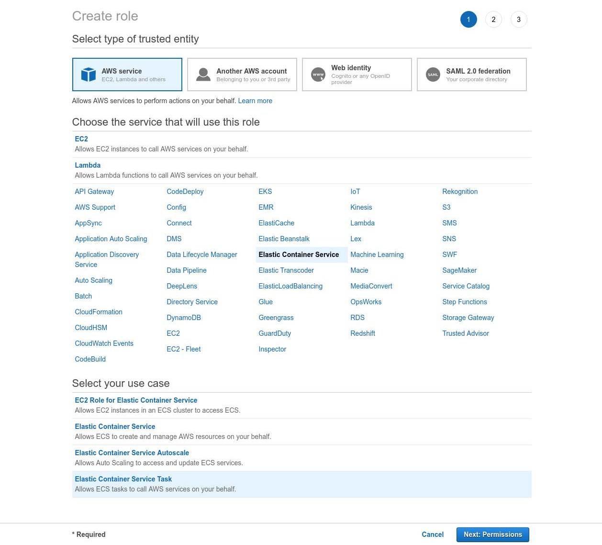

Add policies:
* AmazonEC2ContainerRegistryReadOnly
* AmazonS3ReadOnlyAccess
* CloudWatchLogsFullAccess
* AWSLambdaSQSQueueExecutionRole

The result should look similar to this:

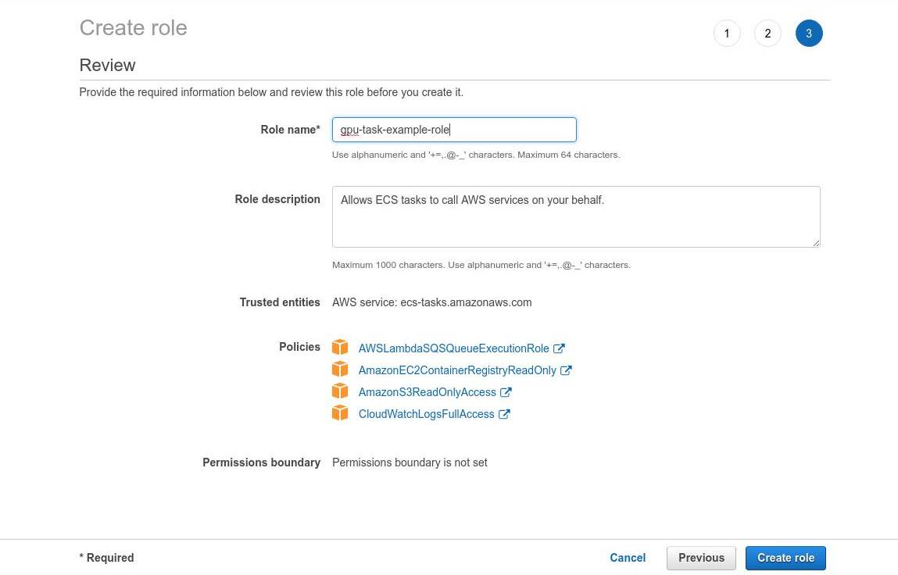


### Create new Task Definition
Name your task definition, select the role you created earlier, set cpu and memory limits. As we will be using one docker container per EC2 instance, we can put limits at capacity of p2.xlarge instance: 48000 MB and 4096 CPU.


Select Edit container and set following fields:
* Container name - gpu-worker-container (any name of your choosing)
* Image - xxxxxxxxxxxxxxxx.dkr.ecr.eu-central-1.amazonaws.com/ml-gpu-example
* Memory Limits (MiB) - Hard limit/48000 (available memory from p2.xlarge)
* CPU units - 4096
* Essential - true
* Entry point - python3,worker.py


### Create new ECS cluster
For simplicity resons we will create a new empty cluster which will use default VPC

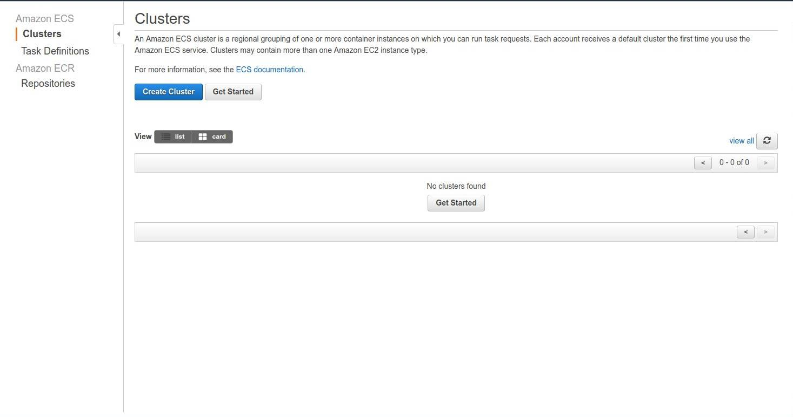

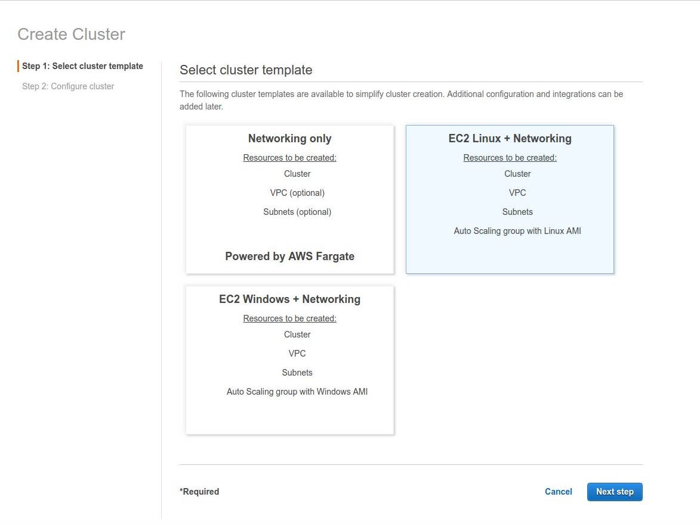

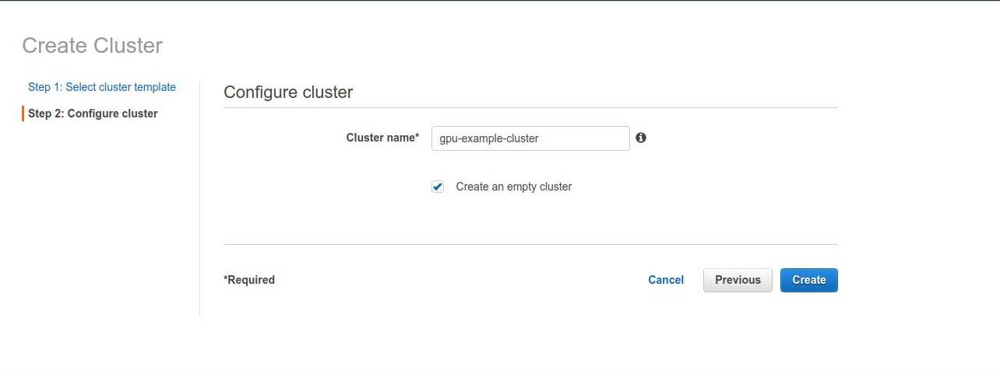

### Create service in the cluster

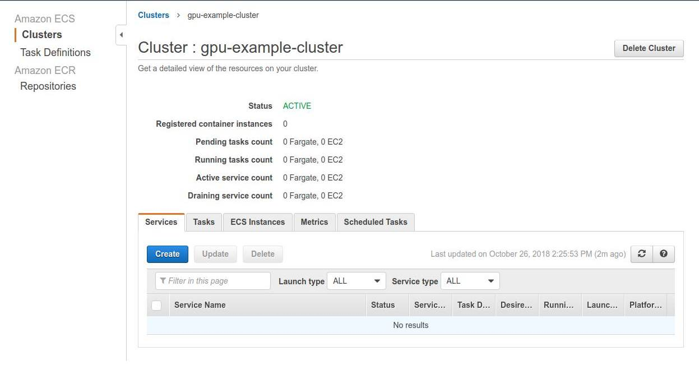


**Configure service:** 

Set following properties:
* Launch type - EC2
* Task Defintion - your task defintion created earlier
* Cluster - your cluster
* Service name - your service name
* Service type - DAEMON

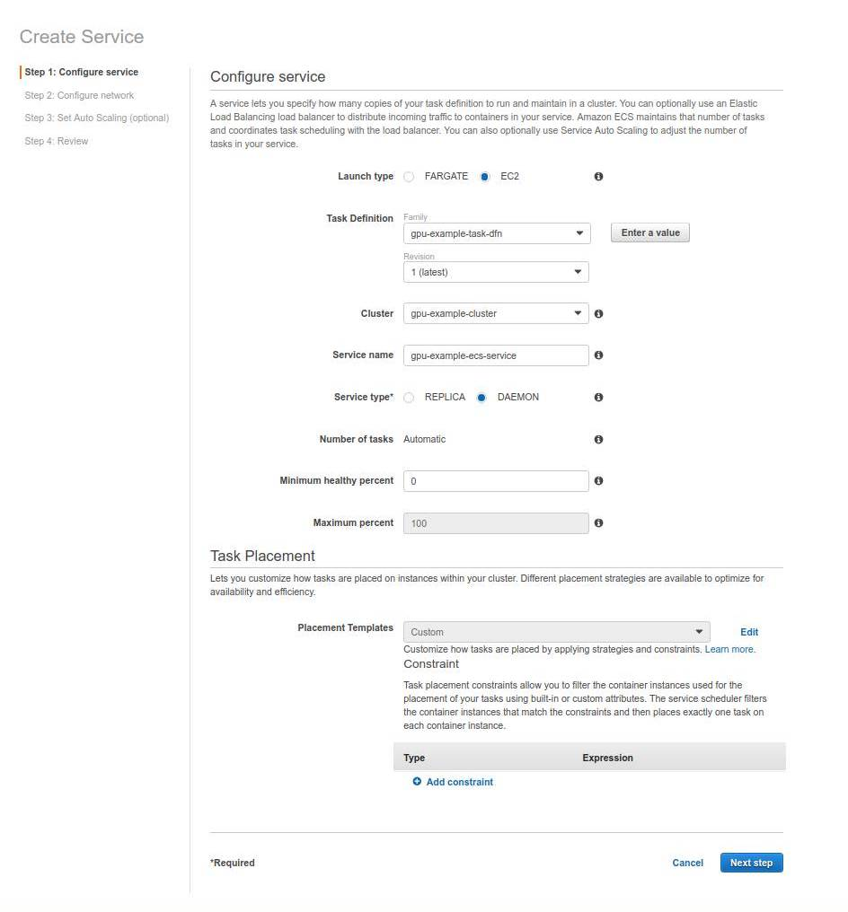
**Configure network:**

Leave Load balancer type None

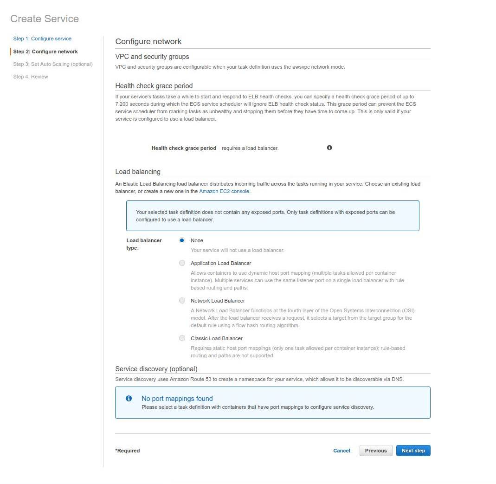

**Set Autoscaling (optional)**

Leave autoscaling as is:

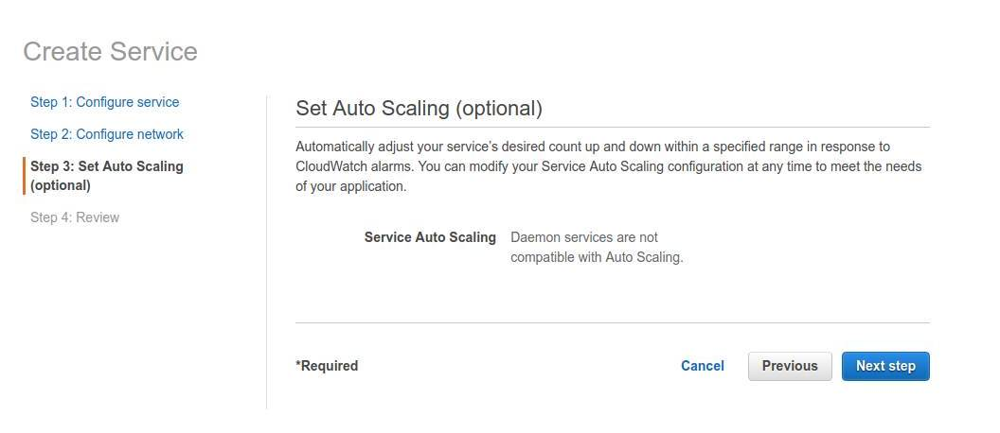

## Create role for EC2


## Create launch template
Set properities:
* Launch template name: ml-gpu-example
* AMI ID: select your created AMI
* Instance type: p2.xlarge
* User data:

```
#!/bin/bash
echo ECS_CLUSTER=gpu-example-cluster >> /etc/ecs/ecs.config;echo ECS_BACKEND_HOST= >> /etc/ecs/ecs.config;
```

## Create Cloud Watch Alarm
Click **Create Alarm** button from Cloud Watch console.
Select metric *ApproximateNumberOfMessagesVisible* for SQS queue you have created earlier (example-gpu-queue), which would be active when there are messages in the queue. Set name, remove default actions and create the alarm.

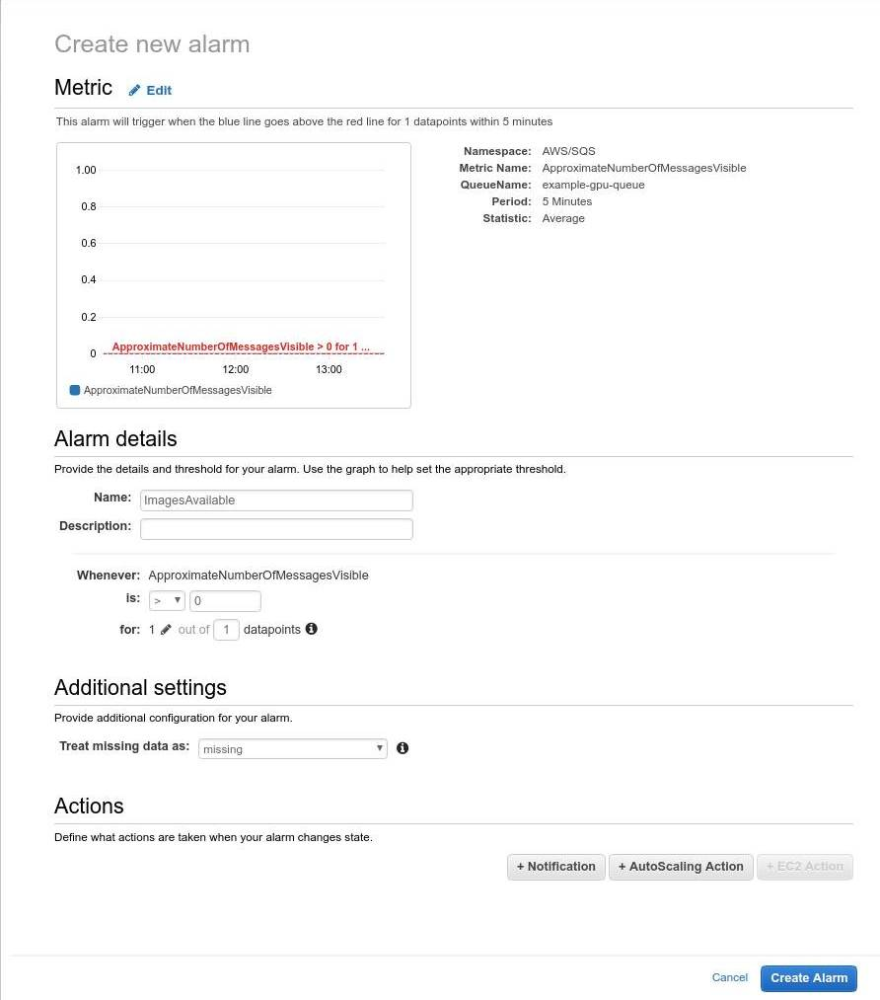

## Create EC2 Autoscaling group

Select autoscaling groups from EC2 console and click **Create Auto Scaling Group**. Select option to create an autoscaling group from Launch Template and select a template created earlier (gpu-example-template).

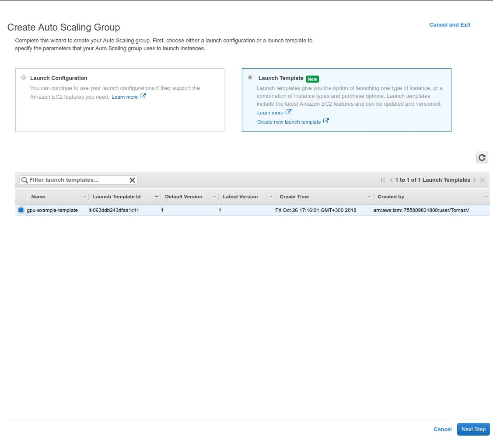

Set name and select subnets for EC2 instances and go to the next step: Configure scaling policies.

Use a step scaling policy to set size of the autoscaling group. One policy is enough if an instance number is set, not increased. Select the Cloudwatch alarm created eralier and define steps for setting number of instances based on number of messages in the queue.

The example policy sets the scaling group size to 1 instance when there is at least 1 message in the message queue and to 2 when the number of messages in the queue is over 100. All instances are removed when there are no messages in the queue. 

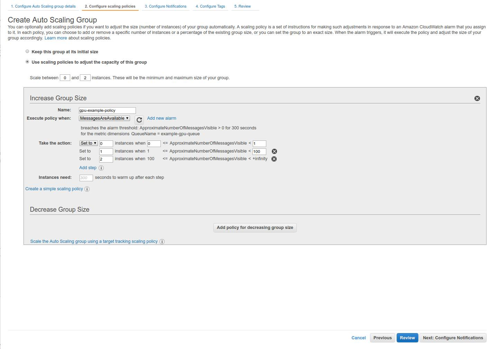

